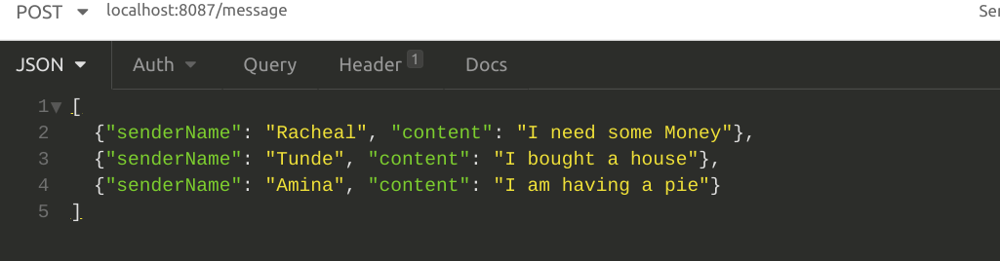
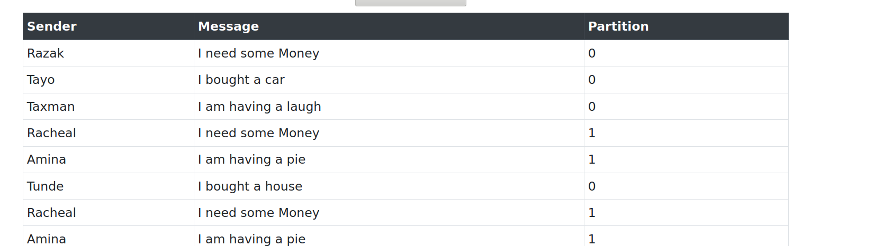

# About

A demo showing basic of use Kafka in a Pub/Sub system. The producer receives messages via REST API call and writes
 them to a Kafka topic from which the consumer reads and buffers these messages before eventually writing them to an
  simple in-memory DB implemented using a list. The consumer displays every message written to the DB on a webpage.
  
  
  
  
  
  
 Both producer and consumer are Spring Boot applications but instead of using the official Spring for Apache Kafka
  library, the API provided by the Kafka Java clients library is used directly. For simplicity, the messages sent to the
   Kafka broker are in JSON format. Apache AVRO is a popular alternative.
  
# Deploying Locally

Start up Zookeeper and Kafka instances using basic configuration(no need to create topics or partitions). Build
 executable JARs for both producer and consumer by using `./mvnw clean install -P{profile}` at the root of the project
 . `profile` is the id of any Maven profile defined in `$HOME/.m2/settings.xml` which specifies at least the port on
  which both apps should be deployed e.g

```xml
 <profile>
   <id>kafka-demo</id>
   <properties>
	<consumer.port>8081</consumer.port>
	<producer.port>8087</producer.port>	
   </properties>	
 </profile>
```

The executable JARs can then be started either by running `java -jar target/{name-of-JAR}.jar` at the roots of `kafka
-producer` and `kafka-consumer` or by building docker images using the Dockerfiles provided and starting containers.

Optionally, the Maven Spring Boot plugin can be used to start up both web app by using `./mvnw spring-boot:run -P
{profile}` 

# Tech

- Java
- Spring Boot
- Apache Kafka
- Thymeleaf & Bootstrap 
